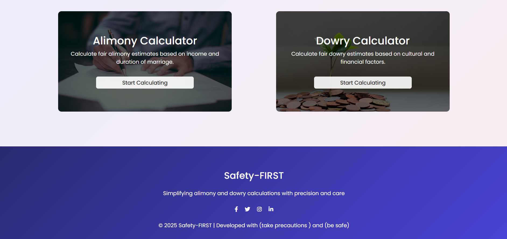
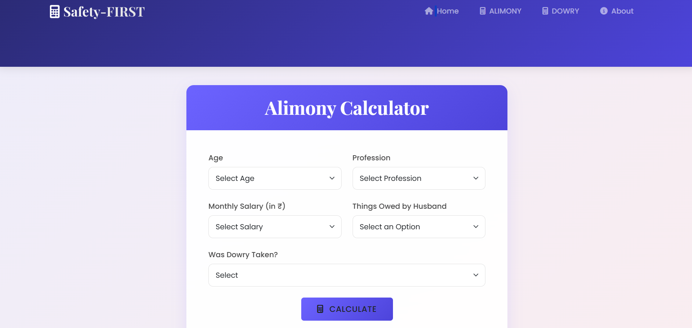
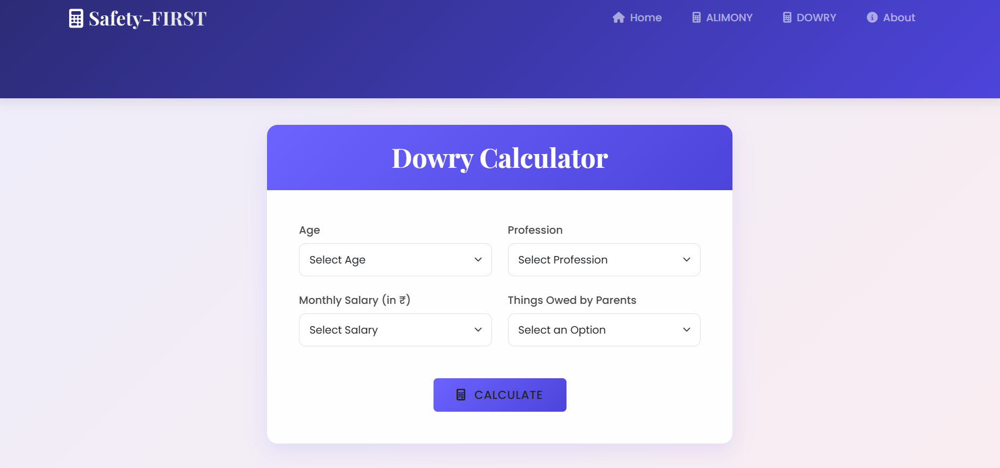

# ⚖️ Alimony and Dowry Calculator

A Django-based web application that helps users estimate potential alimony and dowry-related outcomes using simplified input fields. Designed to raise awareness and provide an interactive, informative experience.


---

## 🚀 Features

- 🔐 Custom user authentication (login/register)
- 🧮 Smart calculator with:
  - Age group selection
  - Profession and salary dropdowns
  - Dowry and property involvement
- 📊 Real-time popup animation showing statistical awareness
- 📰 News redirection after calculation
- 📱 Responsive Bootstrap UI
- 🌐 Favicon for branding and clean browser appearance

---

## 🖼️ UI Previews

| Home Page | 
|-----------|------------------|
|   |

| Home Page | 
|-----------|------------------|
|   |

| Home Page | 
|-----------|------------------|
|   |

---

## 🛠️ Tech Stack

- **Backend:** Django (Python)
- **Frontend:** HTML5, CSS3, Bootstrap 5, JavaScript
- **Templating:** Django Templates
- **Styling:** Bootstrap + Custom CSS
- **Hosting:** PythonAnywhere / Render / Heroku (optional)

---

## 🧩 Installation

```bash
git clone 'link of git'
cd alimony-dowry-calculator
pip install -r requirements.txt
python manage.py migrate
python manage.py runserver
